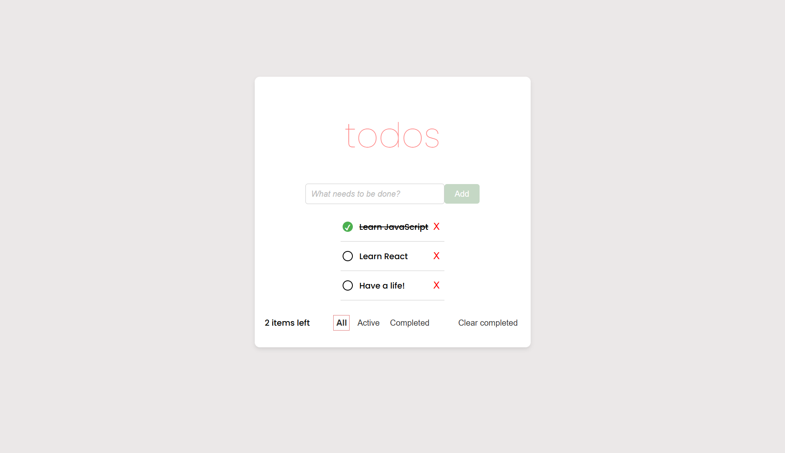

# Todo App

A simple Todo application that allows users to create a list of tasks, mark them as completed, and clear completed tasks.

## Live Demo

You can view the live version of the TodoApp here: [Live Demo](https://todo-app-react-tau-sage.vercel.app/)

## Features

- **Add new tasks** to the list
- **Mark tasks as completed** or uncompleted
- **Delete completed tasks** with a single button click
- **Filter tasks** by "All," "Active," or "Completed"
- **Display the count** of remaining tasks
- **User-friendly and clean interface**

## Technologies Used

- **React**: For component-based UI structure
- **JavaScript**: For application logic
- **CSS**: For styling the application

## Installation

To set up the project on your local machine, follow these steps:

1. **Clone the repository**:
    ```bash
    git clone https://github.com/elfdrkn/TodoApp-React.git
    ```
2. **Navigate to the project directory**:
    ```bash
    cd todo-app
    ```
3. **Install dependencies**:
    ```bash
    npm install
    ```
4. **Start the application**:
    ```bash
    npm start
    ```

Open your browser and go to `http://localhost:3000` to view the application.

## Usage

1. **Add a new task** by typing into the input field and pressing `Enter`.
2. **Mark tasks as completed** by clicking on the checkbox next to the task.
3. **Clear completed tasks** by clicking the "Clear completed" button.
4. **Filter tasks** with the "All," "Active," and "Completed" buttons to view tasks based on their status.

## Folder Structure

- **`src/`**: Contains main files for the app
    - **`App.js`**: Main application component
    - **`components/`**: Contains all individual components
    - **`styles/`**: CSS files for styling the application

## Screenshots

### Main View



## Contributing

If you’d like to contribute, please submit a pull request or open an issue with any suggestions.


